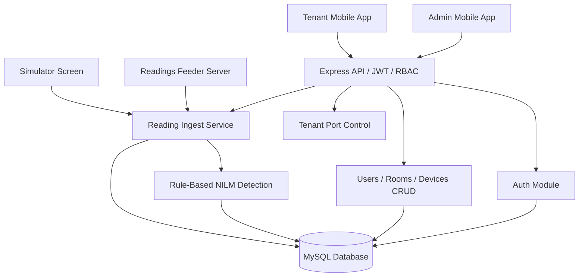

# System Architecture

## Runtime Flow

1. Admin logs in through the mobile app.
2. Backend validates bcrypt password hashes and issues a JWT.
3. Admin registers users, devices, and rooms.
4. Simulator, feeder, or external hardware sends a reading to `POST /api/v1/readings/ingest`.
5. Backend validates the payload, resolves the room through the device, stores reading header/detail, runs NILM scoring, stores detection header/detail, and computes estimated cost.
6. Tenant can remotely turn device ports on or off, and those port states are stored in MySQL.
7. Tenant dashboard reads the latest room summary, remote port state, and recent history.
8. Admin dashboard reads latest room summaries, highest consuming room, and device status.

## Detection Logic

Weighted scoring in the MVP:

- `50%` power similarity
- `20%` power factor similarity
- `15%` frequency similarity
- `15%` THD similarity

Only matches above the configured confidence threshold are stored and returned.
