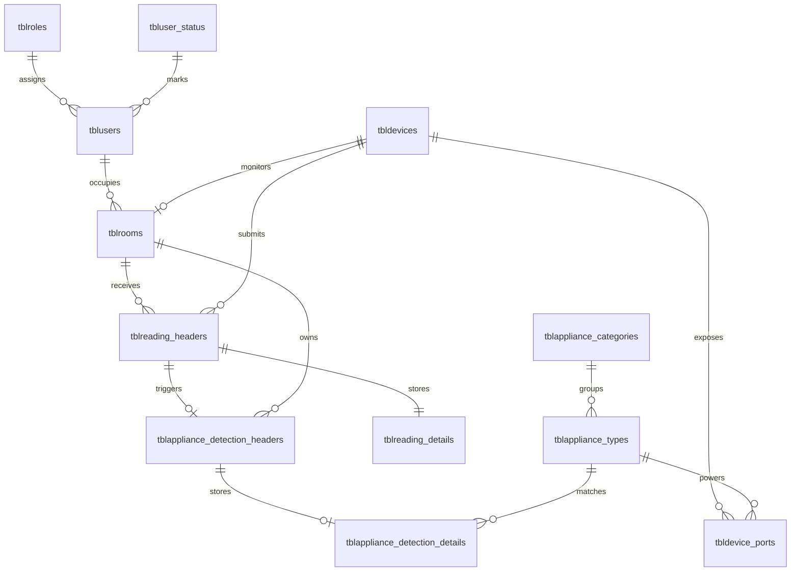

# NILM MVP ERD

The MVP uses the normalized tables requested for the defense and stays aligned with `server/sql/schema.sql`.

## Tables Used

- `tblroles`
- `tbluser_status`
- `tblusers`
- `tbldevices`
- `tbldevice_ports`
- `tblrooms`
- `tblreading_headers`
- `tblreading_details`
- `tblappliance_categories`
- `tblappliance_types`
- `tblappliance_detection_headers`
- `tblappliance_detection_details`

## Business Rules Enforced

- Only `active` users can log in.
- Only `admin` users can manage users, rooms, and devices.
- `device_identifier` is unique.
- Each room must reference a valid tenant and a valid device.
- A device can only be assigned to one room in this MVP.
- Each device port references one configured appliance type and stores a real remote supply state.
- Reading ingest only accepts registered devices.
- Readings must resolve to a room through the assigned device.
- Only detections above the confidence threshold are returned as active appliance matches.
- Estimated cost is computed as `energy_kwh * room_rate_per_kwh`.
